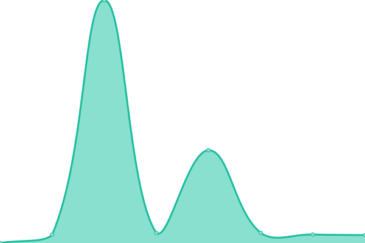

# [📈 Live Status](https://zhujunyong.github.io/ibm-community-upptime): <!--live status--> **🟩 All systems operational**

This repository contains the open-source uptime monitor and status page for [zhujunyong](https://zhujunyong.github.io/ibm-community-upptime), powered by [Upptime](https://github.com/upptime/upptime).

With [Upptime](https://upptime.js.org), you can get your own unlimited and free uptime monitor and status page, powered entirely by a GitHub repository. We use [Issues](https://github.com/zhujunyong/ibm-community-upptime/issues) as incident reports, [Actions](https://github.com/zhujunyong/ibm-community-upptime/actions) as uptime monitors, and [Pages](https://zhujunyong.github.io/ibm-community-upptime) for the status page.

<!--start: status pages-->
<!-- This summary is generated by Upptime (https://github.com/upptime/upptime) -->
<!-- Do not edit this manually, your changes will be overwritten -->
<!-- prettier-ignore -->
| URL | Status | History | Response Time | Uptime |
| --- | ------ | ------- | ------------- | ------ |
|  [IBM Community](https://www.ibm.com/community/) | 🟩 Up | [ibm-community.yml](https://github.com/zhujunyong/ibm-community-upptime/commits/HEAD/history/ibm-community.yml) | 

 1107ms
     
 | 

<a href="https://zhujunyong.github.io/ibm-community-upptime/history/ibm-community">100.00%</a>
    

|  [TechXchange Conference](https://www.ibm.com/community/ibm-techxchange-conference/) | 🟩 Up | [tech-xchange-conference.yml](https://github.com/zhujunyong/ibm-community-upptime/commits/HEAD/history/tech-xchange-conference.yml) | 

 483ms
     
 | 

<a href="https://zhujunyong.github.io/ibm-community-upptime/history/tech-xchange-conference">100.00%</a>
    

|  [HL Community home page](https://community.ibm.com/community/user/home) | 🟩 Up | [hl-community-home-page.yml](https://github.com/zhujunyong/ibm-community-upptime/commits/HEAD/history/hl-community-home-page.yml) | 

 3122ms
     
 | 

<a href="https://zhujunyong.github.io/ibm-community-upptime/history/hl-community-home-page">100.00%</a>
    

|  [HL TechXchange group](https://community.ibm.com/community/user/communities/community-home?CommunityKey=8c64553a-86a9-4af3-a2e6-55826c69b4e2) | 🟩 Up | [hl-tech-xchange-group.yml](https://github.com/zhujunyong/ibm-community-upptime/commits/HEAD/history/hl-tech-xchange-group.yml) | 

 351ms
     
 | 

<a href="https://zhujunyong.github.io/ibm-community-upptime/history/hl-tech-xchange-group">100.00%</a>
    

|  [Support 101](https://www.ibm.com/community/101/) | 🟩 Up | [support-101.yml](https://github.com/zhujunyong/ibm-community-upptime/commits/HEAD/history/support-101.yml) | 

 399ms
     
 | 

<a href="https://zhujunyong.github.io/ibm-community-upptime/history/support-101">100.00%</a>
    

|  [QRadar 101](https://www.ibm.com/community/101/qradar/) | 🟩 Up | [q-radar-101.yml](https://github.com/zhujunyong/ibm-community-upptime/commits/HEAD/history/q-radar-101.yml) | 

 371ms
     
 | 

<a href="https://zhujunyong.github.io/ibm-community-upptime/history/q-radar-101">100.00%</a>
    

<!--end: status pages-->

[**Visit our status website →**](https://zhujunyong.github.io/ibm-community-upptime)

## 📄 License

- Powered by: [Upptime](https://github.com/upptime/upptime)
- Code: [MIT](./LICENSE) © [Anand Chowdhary](https://anandchowdhary.com), supported by [Pabio](https://pabio.com)
- Data in the `./history` directory: [Open Database License](https://opendatacommons.org/licenses/odbl/1-0/)
